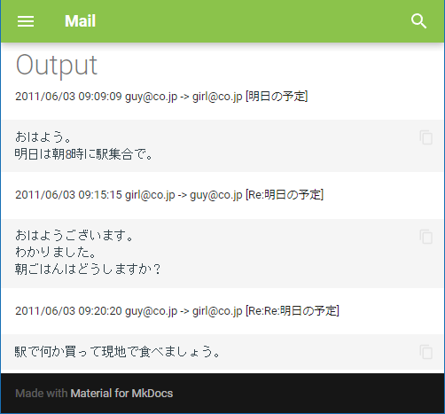

# VMGファイル変換ツール
## 概要
「VMGファイル変換ツール」は携帯電話で使われていた「VMG」拡張子のメールファイルを時系列でマークダウンファイル出力するツールです。  
emlファイルに変換したりメールソフトへインポートせず、過去メールを一覧で見ることが出来ます。

## 使い方
「VMG-Output.exe」をコマンドプロンプトから実行します。  
引数は「VMG-Output.exe［フォルダパス］［マークダウンファイル出力パス］」です。  
フォルダパスにある「*.VMG」拡張子ファイルをサブディレクトリ含めて探索します。  
```
> VMG-Output.exe Sample Sample\output.md
3 ファイルが見つかりました
C:\vmg-output\Sample\E2__0000.VMG 読込[OK]
C:\vmg-output\Sample\E2__0001.VMG 読込[OK]
C:\vmg-output\Sample\E2__0002.VMG 読込[OK]
Sample\output.md 出力 (OK:3, SKIP:0, NG:0
```

## 動作概要
1行ずつ頭文字を認識して処理します。  
空行はスキップします。  
日時、送信元(From)、発信先(To)のいずれかが欠けている場合はキー情報無しとしてファイル読み込みをスキップします。  
日時、送信元(From)、発信先(To)、タイトル、本文が全て同じファイルは重複扱いでスキップします。  
特殊文字や記号は本文扱い、絵文字やデコメ等の変換は行いません。  

## 変換例
VMGファイル
```
BEGIN:VMSG                                   ←無視
VERSION:1.1                                  　〃
X-IRMC-STATUS:READ                           　〃
X-IRMC-TYPE:INET                             　〃
X-IRMC-BOX:SENTBOX                           　〃
BEGIN:VENV                                   　〃
BEGIN:VBODY                                  　〃
Date: Fri, 03 Jun 2011 09:09:09 +0900        ←日時
From: guy@co.jp                              ←送信元
Subject: 明日の予定                          ←タイトル
Reply-To:                                    ←無視
To: girl@co.jp                               ←発信先
Cc:                                          ←無視
Bcc:                                         　〃
MIME-Version: 1.0                            　〃
Content-Type: text/plain; charset=Shift_JIS  　〃
Content-Transfer-Encoding: 8bit              　〃
                                             ←無視(空行)
おはよう。                                   ←本文
明日は朝8時に駅集合で。                      ←本文
                                             ←無視(空行)
END:VBODY                                    ←無視
END:VENV                                     　〃
END:VMSG                                     　〃
```
マークダウンファイル(VMGファイルが複数でも1ファイルに集約)
```
2011/06/03 09:09:09 guy@co.jp -> girl@co.jp [明日の予定]
｀｀｀
おはよう。
明日は朝8時に駅集合で。
｀｀｀
```

「[MkDocs](https://www.mkdocs.org/)」等の静的サイトジェネレーターを使うことで見やすく加工できます。


## 注意事項
作者のガラケーauメールのみテスト済みです。  
他メールソフトは未確認のためご了承下さい。
